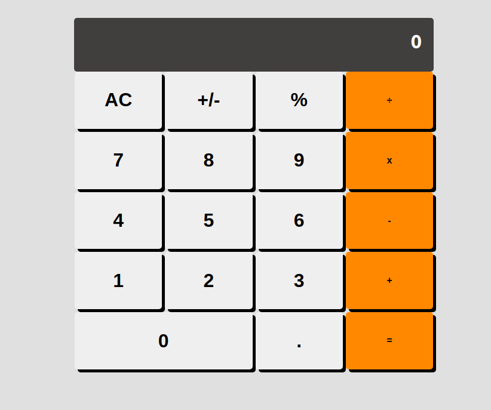

# Math-Magicians
"Math magicians" is a website for all fans of mathematics. It is a Single Page App (SPA) build with React a JavaScript Library. It allows users to: Make simple calculations. Read a random math-related quote.

## Features:
- Displays the calculator's interface

## Built With

- React
- CSS3
- Webpack
- Babel

## Live Demo

[Live Demo Link](https://mihndim2020.github.io/Math-Magicians/)

## Getting Started
- Follow setup instructions below

### Prerequisites

- node.js
- Javascript
- Git and Github
- Terminal
- browser

### Setup

- clone the following repo link, git@github.com:Mihndim2020/Math-Magicians.git
- cd into the directory and run npm install to install dependencies
- run npm start

### Usage
- Run npm install on a Terminal to install the modules
- run npm start
- Open http://localhost:3000 to view it in the browser.

## Author

👤 **Mih Julius Ndim **

- Github: [@Mihndim2020](https://github.com/Mihndim2020)
- Twitter: [@mihndim](https://github.com/mih-julius) 
- Linkedin: [Mih Julius](https://www.linkedin.com/mih-julius)
